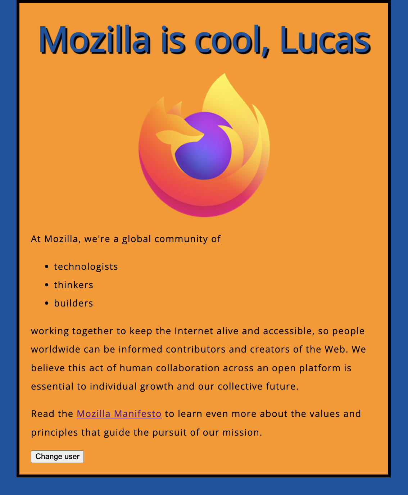

# Mozilla is Cool

> A static website built following MDN's beginner tutorial to get familiar with core web development skills.

## Description
This repo is a hands-on implementation of MDN's [Your First Website tutorial](https://developer.mozilla.org/zh-CN/docs/Learn_web_development/Getting_started/Your_first_website), focusing on:
- Mastering basic HTML, CSS, and JavaScript syntax
- Understanding standard web project structure
- Implementing simple user interactions

## Features
- **Personalized Greeting**: Dynamically displays user name input
- **User Switching**: Click button to reset current user
- **Responsive Images**: Change Mozilla logo when click on the pic

## Preview
